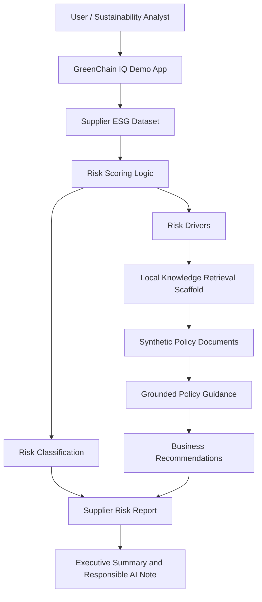

# GreenChain IQ Architecture

## MVP Architecture

## Intended Foundry IQ Architecture

```mermaid
flowchart TD
    A[User / Business Analyst] --> B[Microsoft Foundry Agent]

    B --> C[Supplier ESG Dataset]
    B --> D[Foundry IQ Knowledge Base]

    D --> E[Supplier ESG Policy]
    D --> F[Risk Scoring Guide]
    D --> G[Certification Requirements]
    D --> H[Audit Frequency Rules]
    D --> I[Corrective Action Playbook]

    C --> J[Structured Supplier Risk Evaluation]
    D --> K[Grounded Knowledge Retrieval]

    J --> L[Multi-step Reasoning]
    K --> L

    L --> M[Risk Level: Low / Medium / High]
    L --> N[Risk Drivers]
    L --> O[Recommended Follow-up Actions]
    L --> P[Executive Summary]

    M --> Q[Business-ready Supplier Risk Report]
    N --> Q
    O --> Q
    P --> Q
```

## Architecture Summary

GreenChain IQ is designed as a supplier sustainability risk reasoning agent.

The current MVP uses a local retrieval scaffold to simulate the intended Foundry IQ pattern. It reads synthetic supplier ESG data, evaluates risk drivers, retrieves relevant synthetic policy guidance, and generates business-ready supplier risk reports.

The intended final architecture connects the policy documents to Foundry IQ as a grounded knowledge base. The Microsoft Foundry agent can then use supplier data and retrieved policy context to produce explainable, responsible, and business-relevant sustainability risk recommendations.
